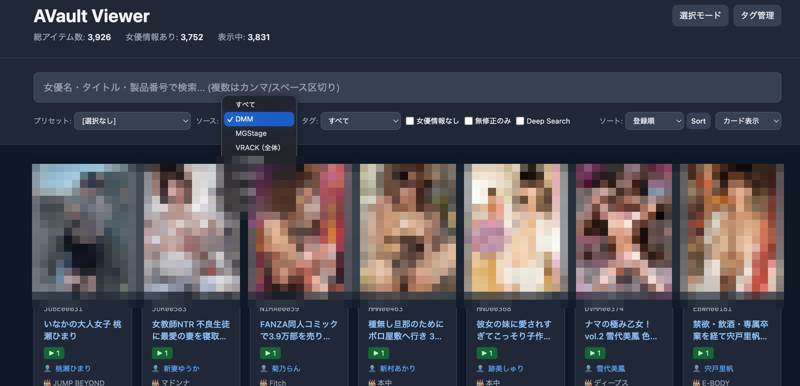

# AVault

> **複数プラットフォームの作品情報を自動収集・統一検索できるオールインワンツール**

DMM、MGStage、VRACK（Hey動画・一本道・HEYZO）、カリビアンなどから購入済み作品の情報を自動スクレイピングし、統一されたWebビューワーで検索・管理。女優の別名から本名を自動検索する「Deep Search」機能により、効率的に作品を発見できます。



### 🎥 収集した作品をこの画面からそのまま視聴

複数サイトに分散していた購入済み作品を **AVault Viewer に集約** し、サムネイル下の ▶ ボタンをクリックするだけで、DMM・MGStage・VRACK（Hey動画・一本道・HEYZO）・カリビアンの動画プレイヤーを直接呼び出して **再ログイン不要で即視聴** できます。複数サイトを行き来する手間なく、横断検索 → 即再生のワンストップ体験を実現します。

### ✨ 主な特徴

- 🎬 **複数ソース統一管理** — DMM・MGStage・VRACK・カリビアンの全作品を1つのビューワーで検索
- 🤖 **自動データ収集** — Puppeteerによる自動スクレイピングで作品情報を定期更新
- 🔍 **Deep Search** — 女優の別名から本名を自動検索、全別名の作品を一括表示
- 🏷️ **スマート管理** — カスタムタグ・プリセット検索で作品をカテゴリー管理
- 💾 **永続セッション** — ブラウザセッション保持で2回目以降はログイン不要
- 🎨 **複数表示モード** — カード表示／テーブル表示で好きなレイアウトを選択
- 📊 **メタデータ充実** — 女優名・メーカー・レーベル・ジャンル・プレイヤーURLなど豊富な情報

### 🚀 クイックスタート

```bash
# コマンド一覧を表示
npm run help

# ビューワーを起動（推奨）
npm run serve          # http://localhost:8000 でサーバー起動

# すべてのスクレイパーを実行
npm run run-all
```

---

## ⚙️ 初期セットアップガイド

初めてこのプロジェクトを使用する場合は、以下の手順に従ってください。

### 環境要件

- **Node.js**: 18以上
- **npm**: 9以上
- **インターネット接続**: スクレイピング時に必要

```bash
# バージョン確認
node --version
npm --version
```

### ステップ1: リポジトリのセットアップ

```bash
# リポジトリをクローン
git clone https://github.com/pty28/avault.git
cd avault

# npm 依存をインストール
npm install
```

### ステップ2: 環境変数の設定

DMM Affiliate API を使用するには、API ID が必要です。
DMMの女優名の取得・メーカーIDの取得はこのAPIで行います。正しい女優名の取得にAPIの利用を推奨します（特に単体系はこちらを推奨します）

```bash
# .env ファイルを作成
cp .env.example .env

# .env ファイルを編集して以下を設定：
# DMM_API_ID=your_api_id_here
# DMM_AFFILIATES_ID=xxxxx-990
```

DMM Affiliate API の取得方法：
1. [DMM Affiliate](https://affiliate.dmm.com/) にアクセス
2. アカウントを作成・ログイン
3. API認証情報を取得

> **ヒント**: API ID がない場合、作品情報の取得（スクレイピング）は可能ですが、女優名・メーカー・レーベル情報の自動取得ができません。代わりに `npm run search-actress` で Web から女優情報を取得するか、`npm run update-performers` で手動入力できます。

**スクレイピング対象サイトの設定（必須確認）:**

登録していないサイトは `false` に設定してスキップしてください：

| 変数 | 対象サイト | デフォルト |
|------|----------|-----------|
| `USE_DMM` | DMM / FANZA | `true` |
| `USE_MGSTAGE` | MGStage | `true` |
| `USE_D2PASS` | VRACK（Hey動画・一本道・HEYZO）・カリビアン | `true` |

例（MGStage に登録していない場合）:
```env
USE_MGSTAGE=false
```

### ステップ3: 初回スクレイピング実行

初回実行時は手動でログインが必要です。ブラウザが自動で開き、各サイトにログインしてください。

```bash
npm run run-all -- --full
```

実行中の動作：
1. **DMM**: ブラウザが開き、手動でログインします（2回目以降は自動）
2. **MGStage**: ブラウザが開き、手動でログインします（2回目以降は自動）
3. **VRACK**: ブラウザが開き、手動でログインします（D2Pass統一認証）
4. **カリビアン**: VRACK と同じセッション（D2Pass統一認証）を使用

各ステップでログイン後、スクレイピングが自動で進行します。

**オプション:**
- `--full`: 全ページを取得（デフォルトは1ページ目のみ）
- `--force`: 既存データを上書き
- 両方指定: `npm run run-all -- --full --force`

**個別実行（オプション）**
```bash
# 個別にスクレイピング実行
npm run scrape-dmm
npm run scrape-mgstage
npm run scrape-vrack
npm run scrape-caribbean

# 女優情報を Web から取得（optional）
npm run search-actress
```

API ID なしでも、各サイトの作品情報（コード・タイトル・プレイヤーURL等）の取得は可能です。女優名などのメタデータは手動で入力するか、Web 検索で補完できます。

> **D2Pass について**: Hey動画（VRACK）とカリビアンは同じ D2Pass サービスで認証されるため、VRACK でログインするとカリビアンにも自動アクセス可能です。

### ステップ4: ビューワーの起動

スクレイピングが完了したら、ビューワーを起動します。

```bash
npm run serve
```

ブラウザで `http://localhost:8000` を開くと、全ソースの作品を検索・管理できます。

### セッションをリセットする

ログイン状態をリセットする必要がある場合：

```bash
# DMM のログイン情報をリセット
rm -rf .puppeteer-profiles/dmm

# MGStage のログイン情報をリセット
rm -rf .puppeteer-profiles/mgstage

# VRACK・カリビアン（D2Pass統一認証）のログイン情報をリセット
rm -rf .puppeteer-profiles/d2pass
```

次回実行時は、リセットされたサイトで再度ログインが必要になります。

### よくあるトラブル

**Q: スクレイピング実行時にエラーが出た**
- A: ネットワーク接続を確認し、`npm run test-api` で DMM API 接続テストを実行

**Q: ビューワーが開かない / データが表示されない**
- A: 以下を確認
  1. `npm run serve` が実行中か
  2. `http://localhost:8000` (推奨) でアクセスしているか
  3. ブラウザコンソール (F12) にエラーがないか

**Q: 女優別名検索（Deep Search）が動作しない**
- A: `data/actresses.db` ファイルが存在するか確認。存在しない場合は以下を実行：
  ```bash
  cp /path/to/actresses.db data/actresses.db
  npm run serve
  ```

**Q: タグが編集できない**
- A: ファイルモード（`file://`）では読み取り専用です。`npm run serve` でサーバーモード起動してください。

**Q: セッション保持が機能しない**
- A: `.puppeteer-profiles/` ディレクトリが正しく保存されているか確認。削除されていれば、再度ログインしてください。

---

## 📋 ディレクトリ構成

```
collection_list/
├── scripts/                           # Node.js スクリプト
│   ├── scrape-dmm-library.js         # DMMライブラリのスクレイピング + プレイヤーURL取得
│   ├── scrape-mgstage.js             # MGStage購入済みストリーミング動画のスクレイピング
│   ├── scrape-vrack.js               # VRACK購入済み動画のスクレイピング
│   ├── scrape-caribbean.js           # カリビアン購入済み動画のスクレイピング
│   ├── run-all.js                    # 全ソース（DMM + MGStage + VRACK + カリビアン）を順次実行
│   ├── serve-viewer.js               # ビューワー用HTTPサーバー（女優API統合済み）
│   │
│   ├── actress-db/                   # 女優別名DBの更新用スクリプト（Python）
│   │   ├── shared/                   # 共通モジュール（database.py）
│   │   ├── scraper/                  # スクレイパー実装
│   │   └── pyproject.toml            # Python依存関係
│   │
│   ├── utils/                        # ユーティリティスクリプト
│   │   ├── generate-viewer.js        # viewer-data.js, presets-data.js等を生成
│   │   ├── list-makers.js            # メーカー一覧を抽出
│   │   ├── list-labels.js            # レーベル一覧を抽出
│   │   ├── list-no-actresses.js      # 女優情報が未入力の作品を一覧
│   │   ├── update-performers.js      # 女優情報を手動更新
│   │   └── ...
│   │
│   └── debug/                        # デバッグ・テストスクリプト
│
├── contents/                         # ビューワー用ファイル
│   ├── viewer.html                   # ビューワー本体
│   ├── presets.json                  # プリセット定義（手動編集可）
│   ├── tag-definitions.json          # タグ定義（手動編集可）
│   └── ...
│
├── data/                             # データファイル
│   ├── dmm-library.json              # DMM作品情報（自動生成）
│   ├── vrack-library.json            # VRACK作品情報（自動生成）
│   ├── mgstage-library.json          # MGStage作品情報（自動生成）
│   ├── caribbean-library.json        # カリビアン作品情報（自動生成）
│   └── actresses.db                  # 女優別名SQLiteデータベース
│
├── .puppeteer-profiles/              # ブラウザセッション・クッキー
│   ├── dmm/                          # DMM ブラウザプロファイル
│   ├── dmm-cookies.json              # DMM セッションクッキー（自動保存）
│   ├── mgstage/                      # MGStage ブラウザプロファイル
│   └── d2pass-cookies.json           # HeyDouga・カリビアン セッションクッキー（自動保存）
│
├── package.json                      # npm スクリプト定義
├── suspicious.log                    # エラーログ
└── .env                              # 環境変数（要作成）
```

---

## 🎬 ビューワー（Viewer）

DMM・VRACK・MGStage・カリビアンの全作品を統一表示・検索・管理できるWebビューワー。

### 起動方法

**サーバーモード（推奨・タグ編集可能）:**
```bash
npm run serve
```
→ `http://localhost:8000` でアクセス

**ファイルモード（タグは読み取り専用）:**
```bash
npm run viewer
```
→ ブラウザで直接ファイルを開く

### 主な機能

- **全ソース統一表示**: DMM・VRACK・MGStage・カリビアンの作品を1つのビューワーで検索
- **検索・フィルター**: 女優名・タイトル・製品コード・メーカー・レーベルで検索
- **タグ機能**: カスタムタグを作成して作品を管理（サーバーモード時のみ編集可）
- **プリセット検索**: よく検索するキーワードを事前登録
- **ソースバッジ**: MGStageアイテムにMGS、VRACKにHEY/HEYZO/1P、カリビアンにCBNバッジを表示
- **複数表示モード**: カード表示 / テーブル表示の切り替え
- **ソート**: 登録順・製品コード・タイトル（日本語対応）

### Deep Search 機能

女優の別名から本名を自動検索、本名の全別名に自動展開する高度な検索機能。

1. 検索ボックス上の「Deep Search」チェックボックスをON
2. 女優名（別名または本名）を入力

**例:**
- 入力: 「藍色なぎ」（別名）
- 自動検索: 本名「茉宮なぎ」の全別名で展開
- 結果: 別名一覧のすべての作品が表示される

詳細は [actress-api.md](docs/specs/actress-api.md) を参照。

### タグ機能

**タグ定義の編集:**
- ビューワーの「タグ管理」ボタン → タグの追加・削除・色変更

**タグの割り当て:**
1. 「選択モード」をON
2. 作品をクリックして複数選択
3. フローティングバーから「タグを割り当て」

**タグデータ:**
- `contents/tag-definitions.json` - タグ定義（手動編集可）
- `contents/tags.json` - タグ割り当て（UIで管理）

### プリセットの編集

プリセット検索は、ビューワーの検索ボックス上部のドロップダウンメニューから **よく使う検索キーワード** を事前登録できる機能です。

**プリセットの設定方法:**

1. `contents/presets.json` を編集：

```json
[
  { "label": "[選択なし]", "query": "" },
  { "label": "コス", "query": "コスプレ レイヤー" },
  { "label": "人気シリーズ", "query": "シリーズ" },
  { "label": "特定メーカー", "query": "メーカー:DMM" }
]
```

**プリセットの仕様:**
- `label`: ドロップダウンメニューに表示される名前
- `query`: 検索クエリ（空白区切りで複数キーワード指定可）
  - 複数キーワード → OR 検索（いずれかに該当）
  - 例：`"コスプレ レイヤー"` → 「コスプレ」**または**「レイヤー」を含む作品
  - 検索対象：製品コード、タイトル、女優名、メーカー、レーベル、メーカーコード
- 先頭のプリセット（`query: ""`）は「検索条件なし」の状態（全作品表示）

2. 変更後は `npm run generate-viewer` で再生成が必要です：

```bash
npm run generate-viewer
```

> **注意**: ビューワー起動中に `presets.json` を編集した場合、ブラウザをリロードしてプリセットの変更を反映してください。

---

## 📊 データ収集（スクレイピング）

各サイトから作品情報を自動取得します。

### 一括実行

**すべてのソースを実行（推奨）:**
```bash
npm run run-all                          # デフォルト（1ページ目のみ）
npm run run-all -- --full                # 全ページ取得
npm run run-all -- --force               # 既存データも上書き
npm run run-all -- --full --force        # 全ページ取得 + 上書き
```
実行順: DMM → MGStage → VRACK → カリビアン

**DMM のみ:**
```bash
npm run run-all-dmm                      # デフォルト（1ページ目のみ）
npm run run-all-dmm -- --full --force    # 全ページ + 上書き
```

**MGStage のみ:**
```bash
npm run run-all-mgs                      # デフォルト（1ページ目のみ）
npm run run-all-mgs -- --full --force    # 全ページ + 上書き
```

### セッション保持機能

すべてのスクレイパーはブラウザセッションを保持します。

**初回実行時:** ブラウザが開きます。サイトに手動でログインしてください。
```bash
npm run scrape-dmm        # DMM にログイン
npm run scrape-mgstage    # MGStage にログイン
npm run scrape-vrack      # VRACK にログイン
npm run scrape-caribbean  # カリビアン にログイン
```

**以降実行時:** ログイン状態が自動復元されるため、ログイン操作は不要です。

**DMM の特別な仕様:**

DMM はセッション管理が厳しいため、クッキーベースの復元メカニズムを採用しています：

1. **初回実行時** — ブラウザでログイン → スクリプトがクッキーを自動保存
2. **2回目以降** — 保存済みクッキーを自動読み込み → ログイン画面をスキップ

クッキーファイル: `.puppeteer-profiles/dmm-cookies.json`（git では除外）

セッションが無効化された場合、手動でクッキーを削除して再度ログインしてください：
```bash
rm .puppeteer-profiles/dmm-cookies.json
npm run scrape-dmm  # 再ログイン
```

**セッションをリセット:**
保持しているログイン情報を何らかの理由で削除したい場合は以下を実行してください。
```bash
rm -rf .puppeteer-profiles/dmm        # DMM のセッション削除
rm -rf .puppeteer-profiles/mgstage    # MGStage のセッション削除
rm -rf .puppeteer-profiles/d2pass     # VRACK・カリビアン のセッション削除
```

> **D2Pass について**: VRACK とカリビアンは D2Pass 統一認証を使用しており、同じセッションプロファイルを共用します。VRACK で1回ログインすればカリビアンにもアクセス可能です。

### 各ソースの個別実行

#### DMM

```bash
npm run scrape-dmm                    # 最初のページのみ
npm run scrape-dmm -- --full          # 全ページ取得
npm run scrape-dmm -- --force         # プレイヤーURL強制再取得
npm run fetch-info                    # 女優名・メーカー・レーベル取得（推奨）
npm run scrape-manufacturer-codes     # メーカー品番取得
npm run search-actress                # Web から女優情報取得
```

詳細は [docs/specs/scraping.md](docs/specs/scraping.md) を参照。

**セットアップ（初回のみ）:**
```bash
cp .env.example .env
# .env ファイルを編集して DMM_API_ID を設定
```

#### MGStage

```bash
npm run scrape-mgstage                # 最初のページのみ
npm run scrape-mgstage -- --full      # 全ページ取得
npm run search-actress-mgstage        # Web から女優情報取得
```

#### VRACK

```bash
npm run scrape-vrack                  # スクレイピング
npm run search-actress-vrack          # Hey動画向け女優検索
npm run search-actress-1pondo         # 一本道向け女優検索
```

#### カリビアン

```bash
npm run scrape-caribbean              # スクレイピング
npm run search-actress-caribbean       # カリビアン向け女優検索
```

#### DMM マイリストからのタグ取得（オプション）

DMMのマイリスト機能を使ってタグを管理している場合、マイリスト情報を自動取得できます：

```bash
npm run scrape-mylist
```

**動作:**
- マイリスト名を `tag-definitions.json` のタグ定義として取り込む
- 各マイリストに含まれる商品を `tags.json` のタグ割り当てとして反映
- 色は自動生成（マイリスト数に応じて均等配分）

> **注意**: このスクリプトはオプション。マイリストベースのタグ管理をしていない場合は不要です。

---

## 🛠️ ユーティリティスクリプト

複数プラットフォーム対応のデータ修正・検索ツール。

### データ修正系

**女優情報を手動更新:**
```bash
npm run update-performers -- VERO00129 "女優名1,女優名2"
npm run update-performers-mgstage -- SIRO05588 "女優名"
npm run update-performers-vrack -- heydouga_123456 "女優名"
```

**Web から女優情報を取得:**
```bash
npm run search-actress                # DMM対象
npm run search-actress -- --force     # 既存データも再取得
npm run search-actress-mgstage        # MGStage対象
npm run search-actress-vrack          # VRACK対象
```

詳細：[scraping.md](docs/specs/scraping.md)

---

## 📌 推奨される使用フロー

### 初回セットアップ

1. `.env` ファイルを作成して DMM API ID を設定
2. `npm install` で依存をインストール
3. `npm run run-all` で全ソースをスクレイピング

### 定期更新

```bash
npm run run-all
```

新規作品を自動取得し、既存データを更新します。

### 日常利用

```bash
npm run serve
```

ビューワーを起動して作品を検索・管理します。

---

## ⚙️ ベストプラクティス

### 大量処理時の注意

- **最初にテスト**: `npm run test-api` で API 接続を確認
- **バックアップ**: 初回実行前に重要なファイルをバックアップ
- **進捗確認**: `npm run check` で取得状況を定期確認

### API レート制限

- DMM API は 1リクエスト/秒 の制限がある
- `--force` フラグは全データを再処理するため、必要な時のみ使用

### データ保護

- `dmm-library.json` は上書き保存される
- `isFetched: true` のアイテムは `--force` 使用時でもスキップされる
- タグデータはサーバーモード（`npm run serve`）でのみ編集可能

---

## 📚 詳細ドキュメント

- **[actress-api.md](docs/specs/actress-api.md)** - 女優別名検索 API 仕様（Deep Search / エンドポイント / DB 更新）
- **[scraping.md](docs/specs/scraping.md)** - スクレイピング詳細仕様（JSON スキーマ / 検索ロジック / トラブルシューティング）
- **[viewer.md](docs/specs/viewer.md)** - ビューワー仕様（機能詳細 / タグシステム / プリセット）

---

## 🔧 開発環境

- Node.js 18以上
- Puppeteer 21.0.0

## 📜 ライセンス

MIT
